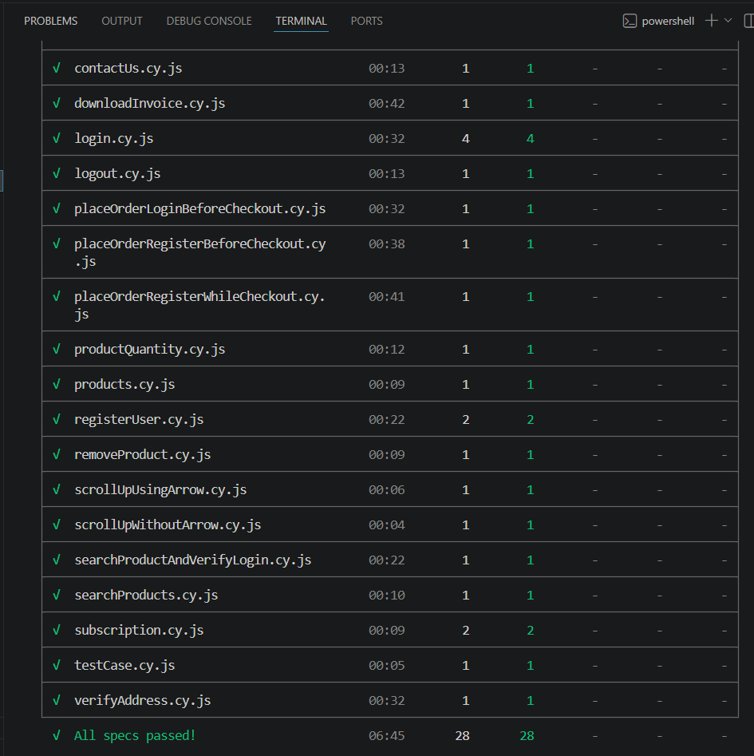

# Cypress Automation Framework

> End-to-end UI automation framework for Automation Exercise built using Cypress and JavaScript following the Page Object Model (POM).

## Overview

This project is a UI automation framework built using Cypress and JavaScript following the Page Object Model (POM) design pattern.

It automates end-to-end test scenarios for the Automation Exercise website using reusable page objects, fixture-based test data management, and maintainable test design.

The framework is designed to demonstrate practical UI automation skills, clean code practices, and a scalable project structure similar to those used in real-world QA projects.

## Tech Stack

- JavaScript (ES6)
- Cypress
- Mocha
- Chai
- Page Object Model (POM)
- Git
- GitHub

## Application Under Test

**Automation Exercise**

https://automationexercise.com/

## Project Structure

The project is organized using a feature-based structure to improve readability and maintainability.

```text
automation-exercise-cypress-framework
│
├── cypress
│   ├── downloads
│   ├── e2e
│   ├── fixtures
│   ├── screenshots
│   └── support
│
├── pages
│   ├── cartPage.js
│   ├── checkOutPage.js
│   ├── contactUsPage.js
│   ├── homePage.js
│   ├── loginPage.js
│   ├── paymentPage.js
│   ├── productsPage.js
│   ├── registrationPage.js
│   └── testCasePage.js
│
├── assets
│   └── test-execution.png
│
├── utils
├── package.json
├── package-lock.json
├── cypress.config.js
├── .gitignore
└── README.md
```

## Test Coverage

The framework automates the following functional areas:

- Home Page
- User Registration
- Login & Logout
- Contact Us
- Test Cases
- Products
- Product Details
- Search Products
- Subscription
- Add to Cart
- Remove Products from Cart
- Cart Persistence
- Product Quantity
- Recommended Products
- Brand & Category Navigation
- Checkout
- Address Verification
- Place Order
- Payment
- Download Invoice
- Scroll Up / Scroll Down

## Framework Design

The framework follows the Page Object Model (POM) design pattern to improve code readability, reusability, and maintainability.

Key design principles:

- Reusable Page Objects with centralized locators
- Fixture-based test data management
- Separation of business actions and assertions
- Modular and maintainable test scripts
- Clear feature-based project organization

## Framework Highlights

- Page Object Model (POM)
- Reusable page methods
- Centralized locators
- Fixture-based test data
- Reusable assertions
- Dynamic test data generation
- End-to-end UI automation workflows
- Clean project structure

## Framework Statistics

- Test Cases: 28
- Spec Files: 23
- Page Objects: 8
- Fixture Files: 8
- Framework Pattern: Page Object Model (POM)

## Prerequisites

Before running the project, ensure the following are installed:

- Node.js
- npm
- Git

## Installation

Clone the repository

```bash
git clone https://github.com/Sneha-AutomationEngineer/automation-exercise-cypress-framework.git
```

Install dependencies

```bash
npm install
```

## Running the Tests

Use the following commands to execute the automation suite.

Open Cypress Test Runner

```bash
npx cypress open
```

Run in headless mode

```bash
npx cypress run
```

## Running a Specific Test

```bash
npx cypress run --spec "cypress/e2e/login.cy.js"
```

## Test Execution

The automation suite has been successfully executed in headless mode.

- Spec Files: 23
- Test Cases: 28
- Passing: 28
- Failing: 0

### Execution Result



## Reports

The framework currently uses the Cypress Test Runner for execution.

The complete suite consists of:

- 23 Spec Files
- 28 Automated Test Cases
- Headless execution using `npx cypress run`

Support for Mochawesome reporting will be added in future enhancements.

## Future Enhancements

- GitHub Actions CI/CD integration
- Mochawesome Reporting
- API Automation
- Cross-browser Execution
- Environment-based Configuration
- Custom Cypress Commands
- Data-driven Test Execution

## Version Control

The project follows a feature-branch Git workflow to keep development organized and maintainable.

- Feature branches for individual enhancements
- Pull Requests for code integration
- AI-assisted code reviews using CodeRabbit

## Author

**Sneha Upadhye**

Software Test Engineer

GitHub: [Sneha-AutomationEngineer](https://github.com/Sneha-AutomationEngineer)

LinkedIn: [Sneha Upadhye](https://www.linkedin.com/in/sneha-upadhye-224297226/)